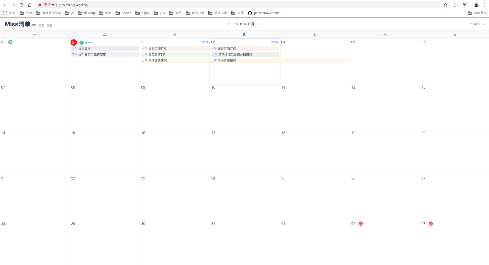

# Miss清单Pro日历版

通过任务的时间线来展示本月所属的任务列表

## 相关

[清单普通版](https://github.com/Jmingzi/todo)

## feature

已实现
- [x] 清单时间线展示
- [x] 日历节日展示
- [x] 任务区分上午下午

待实现
- [ ] 清单时间选择，移除上午下午
- [ ] 即将过期清单提醒
- [ ] 清单状态，待完成，已完成，已过期

## demo

